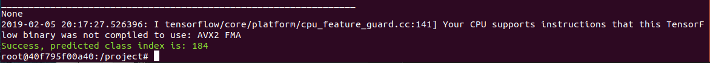

# About
Implementation of:  
Du Tran, Lubomir Bourdev, Rob Fergus, Lorenzo Torresani, Manohar Paluri *Learning Spatiotemporal Features With 3D Convolutional Networks.*
Proceedings of the IEEE International Conference on Computer Vision. 2015. [full article](https://www.cv-foundation.org/openaccess/content_iccv_2015/papers/Tran_Learning_Spatiotemporal_Features_ICCV_2015_paper.pdf)

__Updated to keras 2.2.4__

# Weights
You can __download weights__ of the model trained
on the original dataset ([Sport_1M](https://cs.stanford.edu/people/karpathy/deepvideo/)) here:  
https://drive.google.com/file/d/1rlZ-xTkTMjgWKiQFUedRnHlDgQwx6yTm/view

To run the `c3d/example.py` you should place them in a `models` directory or change the path inside
the [example.py](example.py) accordingly.

The weights were converted from the Caffe format with the code and instructions 
in this project:  
https://github.com/axon-research/c3d-keras

# How to run
1. Build a docker image:  
Run `make build` from the top directory.

2. Check if everything works:  
Run `make example` from the top directory.

You should see this message if everything is ok:


# Model's architecture
```buildoutcfg
Layer (type)                 Output Shape              Param #   
=================================================================
input_2 (InputLayer)         (None, 16, 112, 112, 3)   0         
_________________________________________________________________
conv1 (Conv3D)               (None, 16, 112, 112, 64)  5248      
_________________________________________________________________
pool1 (MaxPooling3D)         (None, 16, 56, 56, 64)    0         
_________________________________________________________________
conv2 (Conv3D)               (None, 16, 56, 56, 128)   221312    
_________________________________________________________________
pool2 (MaxPooling3D)         (None, 8, 28, 28, 128)    0         
_________________________________________________________________
conv3a (Conv3D)              (None, 8, 28, 28, 256)    884992    
_________________________________________________________________
conv3b (Conv3D)              (None, 8, 28, 28, 256)    1769728   
_________________________________________________________________
pool3 (MaxPooling3D)         (None, 4, 14, 14, 256)    0         
_________________________________________________________________
conv4a (Conv3D)              (None, 4, 14, 14, 512)    3539456   
_________________________________________________________________
conv4b (Conv3D)              (None, 4, 14, 14, 512)    7078400   
_________________________________________________________________
pool4 (MaxPooling3D)         (None, 2, 7, 7, 512)      0         
_________________________________________________________________
conv5a (Conv3D)              (None, 2, 7, 7, 512)      7078400   
_________________________________________________________________
conv5b (Conv3D)              (None, 2, 7, 7, 512)      7078400   
_________________________________________________________________
zeropad5 (ZeroPadding3D)     (None, 2, 8, 8, 512)      0         
_________________________________________________________________
pool5 (MaxPooling3D)         (None, 1, 4, 4, 512)      0         
_________________________________________________________________
flatten_2 (Flatten)          (None, 8192)              0         
_________________________________________________________________
fc6 (Dense)                  (None, 4096)              33558528  
_________________________________________________________________
dropout_1 (Dropout)          (None, 4096)              0         
_________________________________________________________________
fc7 (Dense)                  (None, 4096)              16781312  
_________________________________________________________________
dropout_2 (Dropout)          (None, 4096)              0         
_________________________________________________________________
fc8 (Dense)                  (None, 487)               1995239   
=================================================================
Total params: 79,991,015
Trainable params: 79,991,015
Non-trainable params: 0
```

# Features extraction
To extract features from a video you should:
1. Divide a video into 16 frame chunks with 8 frame overlaps *(dim=(16, 112, 112, 3))*.
2. Use output from the first fully connected layer `fc6` as a features from the single chunk.
(implemented in [sport1m_model.create_features_exctractor](c3d/sport1m_model.py))
3. Average features extracted from all vectors to form a single vector *(dim=4096)*.
4. L2-normalize the vector.

Note: Authors used 2 seconds clips during training.